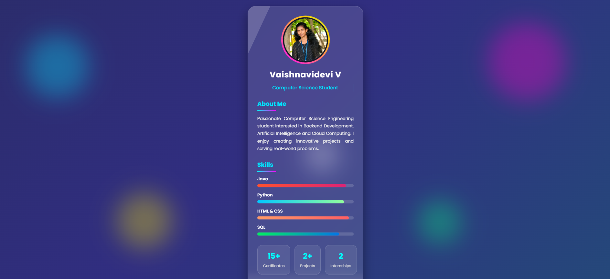

# Personal Profile Card
## Date:03/08/26

## Aim

To design and develop a responsive and attractive Personal Profile Card using HTML and CSS that displays personal information, profile image, skills, hobbies, and social media links with modern styling and interactive effects.

## Algorithm

### Step 1
Create an HTML file (`index.html`).

### Step 2
Create a CSS file (`style.css`).

### Step 3
Add the basic HTML structure with title and meta tags.

### Step 4
Create a profile card container using the `<div>` element.

### Step 5
Insert a profile image, name, designation, and short introduction.

### Step 6
Add sections for About Me, Skills, and Hobbies.

### Step 7
Include a Contact Me button and social media icons.

### Step 8
Apply CSS styles to center the profile card on the page.

### Step 9
Use a gradient background with glassmorphism effects.

### Step 10
Add animations, hover effects, and smooth transitions.

### Step 11
Make the design responsive using CSS media queries.

### Step 12
Test the webpage in different browsers and screen sizes.

### Step 13
Deploy the project.

### Step 14
Host the project using GitHub Pages.

## Program
## index.html
```
<!DOCTYPE html>
<html lang="en">

<head>

    <meta charset="UTF-8">

    <meta name="viewport" content="width=device-width, initial-scale=1.0">

    <title>Vaishnavidevi | Digital Profile</title>

    <!-- Google Font -->
    <link href="https://fonts.googleapis.com/css2?family=Poppins:wght@300;400;500;600;700&display=swap"
        rel="stylesheet">

    <!-- Font Awesome -->
    <link rel="stylesheet"
        href="https://cdnjs.cloudflare.com/ajax/libs/font-awesome/6.6.0/css/all.min.css">

    <link rel="stylesheet" href="style.css">

</head>

<body>

    <!-- Animated Background -->

    <div class="bg-animation">

        <span></span>
        <span></span>
        <span></span>
        <span></span>
        <span></span>

    </div>

    <!-- Main Card -->

    <div class="card">

        <!-- Header -->

        <div class="header">

            <div class="image-box">

                

            </div>

            <h1>Vaishnavidevi V</h1>

            <p class="typing">
                Computer Science Student
            </p>

        </div>

        <!-- About -->

        <div class="section">

            <h2>About Me</h2>

            <p>

                Passionate Computer Science Engineering student interested in
                Backend Development, Artificial Intelligence and Cloud Computing.
                I enjoy creating innovative projects and solving real-world
                problems.

            </p>

        </div>

        <!-- Skills -->

        <div class="section">

            <h2>Skills</h2>

            <div class="skill">

                <span>Java</span>

                <div class="bar">
                    <div class="fill java"></div>
                </div>

            </div>

            <div class="skill">

                <span>Python</span>

                <div class="bar">
                    <div class="fill python"></div>
                </div>

            </div>

            <div class="skill">

                <span>HTML & CSS</span>

                <div class="bar">
                    <div class="fill html"></div>
                </div>

            </div>

            <div class="skill">

                <span>SQL</span>

                <div class="bar">
                    <div class="fill sql"></div>
                </div>

            </div>

        </div>

        <!-- Statistics -->

        <div class="stats">

            <div class="box">

                <h3>15+</h3>

                <p>Certificates</p>

            </div>

            <div class="box">

                <h3>2+</h3>

                <p>Projects</p>

            </div>

            <div class="box">

                <h3>2</h3>

                <p>Internships</p>

            </div>

        </div>
```
## style.css
```

*{
    margin:0;
    padding:0;
    box-sizing:border-box;
    font-family:'Poppins',sans-serif;
}

body{

    min-height:100vh;

    display:flex;

    justify-content:center;

    align-items:center;

    background:linear-gradient(
        135deg,
        #0f172a,
        #1e293b,
        #312e81,
        #0f766e
    );

    background-size:400% 400%;

    animation:gradientBG 15s ease infinite;

    overflow:hidden;

    padding:40px;

}

/* Animated Gradient */

@keyframes gradientBG{

0%{
background-position:0% 50%;
}

50%{
background-position:100% 50%;
}

100%{
background-position:0% 50%;
}

}

/* ================================
      FLOATING GLOW CIRCLES
================================ */

.bg-animation span{

position:absolute;

display:block;

border-radius:50%;

filter:blur(40px);

opacity:.35;

animation:float 12s linear infinite;

}

.bg-animation span:nth-child(1){

width:220px;
height:220px;
background:#00e5ff;
left:5%;
top:15%;

}

.bg-animation span:nth-child(2){

width:280px;
height:280px;
background:#ff00c8;
right:8%;
top:10%;

animation-delay:3s;

}

.bg-animation span:nth-child(3){

width:180px;
height:180px;
background:#ffee00;
left:20%;
bottom:10%;

animation-delay:6s;

}
```

## Output



## Result

The Personal Profile Card was designed successfully using HTML and CSS. The webpage includes a responsive layout, modern glassmorphism design, animated effects, skill bars, hobbies section, and social media icons. The project was successfully deployed using GitHub Pages.
